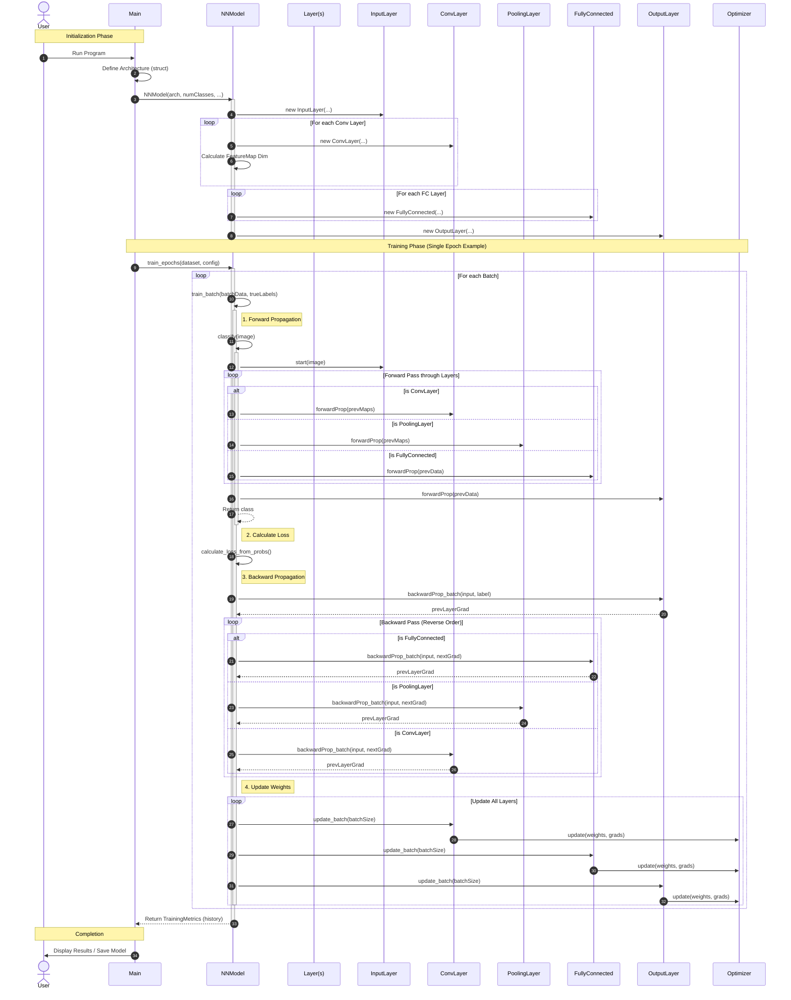

# Software Design Document: CGROOT++

**Project Name:** CGROOT++  
**Version:** 1.0.0  
**Date:** December 23, 2025  

---

## 1. Introduction

### 1.1 Problem Statement
Deep learning frameworks like PyTorch and TensorFlow are powerful tools that abstract away the underlying mathematical mechanics, effectively making them "black boxes" for students and researchers. CGROOT++ addresses the lack of lightweight, educational frameworks that provide low-level implementations of automatic differentiation, convolutional operations, and optimization algorithms in C++ while remaining accessible via a user-friendly GUI.

### 1.2 Scope
- **What the software does:**
    - Implements core neural network layers: Convolutional (Conv2D), Pooling (Max/Average), Flatten, and Fully Connected layers.
    - Supports multiple activation functions (ReLU, Sigmoid, Tanh, Softmax) and advanced optimizers (Adam, RMSprop, Momentum).
    - Includes a feature-rich Python GUI (PyQt6) for interactive model configuration, real-time training visualization, feature map inspection, and image inference.
    - Enables model persistence (saving/loading architecture and weights) for reproducible experiments.
    - Utilizes OpenMP for multi-threaded CPU acceleration.
- **What the software does NOT do:**
    - It does not support GPU acceleration (CUDA/OpenCL).
    - It does not support distributed training or cloud-based deployment.

### 1.3 Target Audience
- **Students & Educators:** Those seeking to understand the internal mathematics and implementation of deep learning (CNNs, Backpropagation).

---

## 2. System Analysis

### 2.1 Functional Requirements
- **FR-01 Data Loader:** The system shall parse and load MNIST-format (IDX) binary datasets (MNIST, Fashion-MNIST, CIFAR-10) and automatically pair label files with image files.
- **FR-02 Neural Network Engine:** The system shall support complex architectures with Convolutional, Pooling (Max/Avg), Flatten, and Fully Connected layers, utilizing core activations (ReLU, Sigmoid, Tanh, Softmax) and loss functions (MSE, Cross-Entropy).
- **FR-03 Automatic Differentiation:** The system must implement a dynamic computational graph to automatically calculate gradients for all parameters via backpropagation.
- **FR-04 Optimization:** The system shall support advanced optimizers including SGD, SGD with Momentum, Adam, and RMSprop.
- **FR-05 Training & Inference:** The system shall support batch training with validation splits, real-time metric tracking, model persistence (save/load), and single-image inference.
- **FR-06 Graphical User Interface:** The Python-based GUI shall provide interactive configuration, real-time visualization of training metrics and image previews, feature map visualization, and comprehensive logging.

### 2.2 Non-Functional Requirements
- **NFR-01 Performance:** Heavy mathematical operations shall be implemented in optimized C++ utilizing OpenMP for parallelization to ensure high throughput.
- **NFR-02 Usability:** The GUI must remain responsive during training. 
- **NFR-03 Reliability:** Gradient calculations must be numerically verified, and the system must handle data types safely between C++ and Python.
- **NFR-04 Extensibility:** The modular architecture (using pybind11) shall allow for easy addition of new layers and optimizers without refactoring the core engine.
- **NFR-05 Portability:** The system must be cross-platform (Windows, Linux, macOS), buildable via CMake, and function entirely locally without external dependencies.

---

## 3. Software Development Process Model

### 3.1. Overview

The development of **CGROOT++** followed the **Fountain Model**, a process specifically tailored for Object-Oriented Software Engineering (OOSE). Unlike linear models, the Fountain Model acknowledges that in object-oriented development, phases such as analysis, design, and implementation often overlap. This approach allowed the team to iterate on the core C++ class hierarchies (such as `Layer` and `Optimizer`) while simultaneously refining the Python-based GUI, ensuring a cohesive integration of the distinct architectural layers.

---

### 3.2. Justification for Model Selection

The Fountain Model was selected due to the intrinsic nature of the project's codebase:

- **Object-Oriented Design:** The system is built upon a rigid inheritance structure where specific layers (e.g., `ConvLayer`, `FullyConnected`) derive from an abstract `Layer` base class.

- **Modularity:** The separation of the core engine (C++) and the user interface (Python) allowed for distinct development circles that "bubbled up" to integration.

- **Iterative Refinement:** The complexity of mathematical operations (such as backpropagation) required frequent iteration between the System Design (Class Diagrams) and Implementation phases to ensure numerical stability.

---

### 3.3. Development Phases

#### 3.3.1. User Requirements & Analysis (The Base)

**Objective:**  
To define the educational goals and functional necessities of the framework.

**Activities:**
- Establishing the need for a transparent "white-box" deep learning tool.
- Defining the scope of supported layers and optimizers.

**Deliverable:**  
The *System Analysis* specification (Section 2).

---

#### 3.3.2. Object-Oriented System Design

**Objective:**  
To model real-world mathematical concepts as interacting software objects.

**Activities:**
- **Defining the Class Hierarchy:** Structuring the abstract `Layer` class and its polymorphic relationship with `InputLayer`, `ConvLayer`, and `OutputLayer`.
- **Architectural Patterning:** Adopting the Model-View-Controller (MVC) pattern to decouple the neural network logic (`NNModel`) from the GUI visualization.

**Deliverable:**  
Class Diagrams and Sequence Diagrams (Section 4).

---

#### 3.3.3. Implementation & Unit Testing (Overlapping Phase)

**Objective:**  
To implement the designed classes and verify their individual behaviors.

**Activities:**
- **Core Logic:** Implementing the C++ tensor operations and OpenMP-based parallelization.
- **Component Testing:** As each class (e.g., MSE loss function or Adam optimizer) was implemented, it was immediately unit-tested to verify mathematical accuracy before integration into the larger `NNModel`.

**Deliverable:**  
The C++ source code (`src/core`) and Python bindings (`src/bindings`).

---

#### 3.3.4. Integration & System Evolution

**Objective:**  
To merge the backend computation engine with the frontend user interface.

**Activities:**
- Bridging the C++ and Python environments using **pybind11**.
- Developing GUI widgets (`TrainingWidget`, `MetricsWidget`) to visualize the live state of the underlying C++ objects.

**Deliverable:**  
The complete, integrated application and the *Implementation Details* documentation (Section 5).

---

#### 3.3.5. Maintenance & Further Development

**Objective:**  
To extend and evolve the framework over time.

**Activities:**  
The modular nature of the Fountain Model allows new features (such as additional activation functions or optimizers) to be introduced by extending existing base classes, without requiring major restructuring of the overall system.

## 4. System Design

### 4.1 Sequence Diagram

### 4.2 Class Diagram

```mermaid
classDiagram
direction TB
    class ModelController {
	    + create_model(config)
	    + start_training()
	    + stop_training()
	    + requestLoadDataset(images, labels)
	    + requestTrain(config)
	    + requestInference(image)
    }

    class Bindings {
	    ~~PyBind11~~
	    + create_model(dict) NNModel*
	    + classify_pixels(buffer) int
	    + bind_model(module)
    }

    class MNISTLoader {
	    ~~Static Utility~~
	    + load_training_data(images_path, labels_path) MNISTDataset
	    + load_test_data(images_path, labels_path) MNISTDataset
	    + create_batches(dataset, batch_size) vector~vector~MNISTImage~~
    }

    class MNISTDataset {
	    + vector~MNISTImage~ images
	    + size_t num_images
	    + size_t image_width
	    + size_t image_height
    }

    class NNModel {
	    - vector~Layer*~ Layers
	    - image data
	    - size_t imageHeight
	    - size_t imageWidth
	    - size_t imageDepth
	    - vector~TrainingMetrics~ trainingHistory
	    + NNModel(architecture, ...)
	    + train(image, int) pair~double,int~
	    + train_batch(vector~image~, vector~int~) pair~double,int~
	    + train_epochs(dataset, config, ...) vector~TrainingMetrics~
	    + classify(image) int
	    + getLayerFeatureMaps(layerIndex)
	    + getLayerType(layerIndex)
	    + store(folderPath) bool
	    + load(filePath) bool
	    + getTrainingHistory()
    }

    class Definitions {
	    ~~Enumeration~~
	    OptimizerType
	    LayerType
	    activationFunction
	    initFunctions
	    poolingLayerType
	    distributionType
    }

    class architecture {
	    + size_t numOfConvLayers
	    + size_t numOfFCLayers
	    + vector~convKernels~ kernelsPerconvLayers
	    + vector~size_t~ neuronsPerFCLayer
	    + vector~activationFunction~ convLayerActivationFunc
	    + vector~activationFunction~ FCLayerActivationFunc
	    + vector~initFunctions~ convInitFunctionsType
	    + vector~initFunctions~ FCInitFunctionsType
	    + distributionType distType
	    + vector~size_t~ poolingLayersInterval
	    + vector~poolingLayerType~ poolingtype
	    + vector~poolKernel~ kernelsPerPoolingLayer
	    + OptimizerConfig optConfig
    }

    class TrainingConfig {
	    + size_t epochs
	    + size_t batch_size
	    + float validation_split
	    + bool use_validation
	    + bool shuffle
	    + uint random_seed
    }

    class TrainingMetrics {
	    + int epoch
	    + double train_loss
	    + double train_accuracy
	    + double val_loss
	    + double val_accuracy
    }

    class Layer {
	    ~~Abstract~~
	    + getLayerType() LayerType*
    }

    class inputLayer {
	    - imageType normalizedImage
	    - LayerType type
	    + inputLayer(height, width, depth)
	    + start(image)
	    + getOutput() imageType
    }

    class convLayer {
	    - vector~kernelType~ kernels
	    - vector~kernelType~ d_kernels
	    - vector~double~ bias
	    - vector~double~ d_bias
	    - vector~featureMapType~ featureMaps
	    - convKernels kernel_info
	    - vector~vector~vector~Optimizer*~~~ kernelOptimizers
	    - Optimizer* biasOptimizer
	    + convLayer(kernelConfig, ...)
	    + initKernel(...)
	    + forwardProp(inputFeatureMaps)
	    + backwardProp(inputFeatureMaps, grads)
	    + backwardProp_batch(inputFeatureMaps, grads)
	    + update()
	    + update_batch(n)
	    + convolute(inputFeatureMaps)
    }

    class poolingLayer {
	    - poolKernel kernel_info
	    - poolingLayerType poolingType
	    - vector~featureMapType~ featureMaps
	    + poolingLayer(kernelConfig, ...)
	    + forwardProp(inputFeatureMaps)
	    + backwardProp(inputFeatureMaps, grads)
	    + backwardProp_batch(inputFeatureMaps, grads)
    }

    class FlattenLayer {
	    - vector~double~ flattened_Arr
	    + FlattenLayer(h, w, d)
	    + forwardProp(featureMaps)
	    + backwardProp(grads)
	    + backwardProp_batch(grads)
	    + flat(featureMaps)
	    + applyOptimizer(opt)
    }

    class outputLayer {
	    - vector~weights~ neurons
	    - vector~double~ bias
	    - vector~double~ outputData
	    - vector~Optimizer*~ neuronOptimizers
	    - Optimizer* biasOptimizer
	    + outputLayer(numOfClasses, ...)
	    + forwardProp(inputData)
	    + backwardProp(inputData, correctClass)
	    + backwardProp_batch(inputData, correctClass)
	    + update()
	    + update_batch(n)
	    + getClass() int
    }

    class Optimizer {
	    ~~Abstract~~
	    # double learning_rate
	    # double weight_decay
	    + update(weights, grads)*
    }

    class SGD {
	    + update(weights, grads)
    }

    class SGD_Momentum {
	    - double momentum
	    - vector~double~ v
	    + update(weights, grads)
    }

    class Adam {
	    - double beta1
	    - double beta2
	    - double epsilon
	    - int t
	    - vector~double~ m
	    - vector~double~ v
	    + update(weights, grads)
    }

    class RMSprop {
	    - double beta
	    - double epsilon
	    - vector~double~ s
	    + update(weights, grads)
    }

    class FullyConnected {
	    - vector~weights~ neurons
	    - vector~double~ bias
	    - vector~double~ outputData
	    - vector~Optimizer*~ neuronOptimizers
	    - Optimizer* biasOptimizer
	    + FullyConnected(numOfNeurons, ...)
	    + forwardProp(inputData)
	    + backwardProp(inputData, grads)
	    + backwardProp_batch(inputData, grads)
	    + update()
	    + update_batch(n)
    }

    Layer <|-- inputLayer
    Layer <|-- convLayer
    Layer <|-- poolingLayer
    Layer <|-- FullyConnected
    Layer <|-- FlattenLayer
    Layer <|-- outputLayer
    Optimizer <|-- SGD
    Optimizer <|-- SGD_Momentum
    Optimizer <|-- Adam
    Optimizer <|-- RMSprop
    ModelController ..> Bindings : invokes
    Bindings ..> NNModel : creates/wraps
    Bindings ..> MNISTLoader : uses
    MNISTLoader ..> MNISTDataset : produces
    NNModel ..> MNISTDataset : consumes
    NNModel "1" *-- "*" Layer : contains
    NNModel ..> architecture : uses
    NNModel ..> TrainingConfig : uses
    NNModel ..> TrainingMetrics : produces
    NNModel ..> Optimizer : uses
    FullyConnected ..> Optimizer : uses
    convLayer ..> Optimizer : uses
    outputLayer ..> Optimizer : uses

	style ModelController fill:#e3f2fd,stroke:#1565c0,stroke-width:2px,stroke-dasharray: 5 5
	style Bindings fill:#eceff1,stroke:#455a64,stroke-width:2px
	style MNISTLoader fill:#e0f2f1,stroke:#00695c,stroke-width:2px
	style MNISTDataset fill:#e0f2f1,stroke:#00695c,stroke-width:2px
	style NNModel fill:#e1f5fe,stroke:#01579b,stroke-width:2px
	style Definitions fill:#e1f5fe,stroke:#01579b,stroke-width:2px
	style architecture fill:#e1f5fe,stroke:#01579b,stroke-width:2px
	style TrainingConfig fill:#e1f5fe,stroke:#01579b,stroke-width:2px
	style TrainingMetrics fill:#e1f5fe,stroke:#01579b,stroke-width:2px
	style Layer fill:#fafafa,stroke:#333,stroke-width:2px,stroke-dasharray: 5 5
	style inputLayer fill:#f3e5f5,stroke:#4a148c,stroke-width:2px
	style convLayer fill:#f3e5f5,stroke:#4a148c,stroke-width:2px
	style poolingLayer fill:#f3e5f5,stroke:#4a148c,stroke-width:2px
	style FlattenLayer fill:#f3e5f5,stroke:#4a148c,stroke-width:2px
	style outputLayer fill:#f3e5f5,stroke:#4a148c,stroke-width:2px
	style Optimizer fill:#fafafa,stroke:#333,stroke-width:2px,stroke-dasharray: 5 5
	style SGD fill:#e8f5e9,stroke:#1b5e20,stroke-width:2px
	style SGD_Momentum fill:#e8f5e9,stroke:#1b5e20,stroke-width:2px
	style Adam fill:#e8f5e9,stroke:#1b5e20,stroke-width:2px
	style RMSprop fill:#e8f5e9,stroke:#1b5e20,stroke-width:2px
	style FullyConnected fill:#f3e5f5,stroke:#4a148c,stroke-width:2px
```

---

## 5. Implementation Details

### 5.1. Tech Stack
- **Core Logic:** C++ for high-performance tensor operations and OpenMP for multi-threaded parallel processing.
- **GUI Framework:** Python 3.13 with PyQt6 for a responsive, cross-platform interface.
- **Interface Bridge:** pybind11 to expose C++ neural network classes and functions to the Python environment.
- **Visualization:** PyQtGraph for real-time loss/accuracy metrics and QImage/QPainter for feature map rendering.

### 5.2. Architectural Design
Due to the nature of how neural networks work and how we foresaw the program to work and behave, a combination of three architectural design patterns was used:

#### 5.2.1. Model-View-Controller (MVC) Architecture
The main Idea in mind in making the project is to be educational and simple, so a GUI is needed for this purpose, so the MVC pattern were used since the program is interactive, and information needs to be conveyed to the user in different ways.

- **Model:** The Neural Network model implemented in C++ (NNModel) and the training logic handled by ModelWorker in Python. 
- **View:** The GUI, composed of several specialized widgets:
    - Training Tab: Displays "Training Preview" (images and labels) and "Feature Maps".
    - Metrics Tab: Visualizes "Loss" and "Accuracy" charts.
    - Configuration Tab: Provides fields for "Hyperparameters" (Learning Rate, Epochs, Batch Size) and "Network Architecture" (Conv/FC layer counts).
    - Log Output: Real-time terminal-style logging at the bottom of the window.
- **Controller:** The ModelController and ModelWorker manage the flow of data between the GUI and the C++ backend using asynchronous threads (QThread) to keep the UI responsive during heavy computation.

#### 5.2.2. Layered Architecture 
The program is complex so abstractions at different layers are needed.
The layering structure is simple and consists of three main layers:

- **The (Neural Network) Layers:** which consists of the class Layer and its derivative classes (inputLayer, convLayer, poolingLayer, FullyConnected, FlattenLayer, outputLayer) with every layer being abstract as it hides its algorithms and only communicates with its user using simple functions (3.2 Class Diagram).
- **Neural Network Model (NNModel):** Responsible for training logic. The user interacts via the GUI to set "Learning Rate", "Optimizer", and "Weight Decay". It uses functions like classify, train, train_batch, and train_epochs (3.2 Class Diagram).
- **GUI:** Further abstractions is accomplished using the GUI since the user doesn’t need to write code to load the data to the model or how to use the model functions, all the user needs is to use the simple and informative GUI.

#### 5.2.3. Pipe and Filter Architecture
What neural networks do are basically doing data processing and updating some variables using the results, and the processing is done sequentially as every layer does it works on the data and pass it to the next layer (the NNModel class is the one responsible for this operation). The processing operations consists of two main operations (3.3 Sequence Diagram):

- **Forward Propagation:** Input -> Convolution -> Pooling -> Flatten -> Fully Connected -> Output
- **Backward Propagation and update:** Output -> Fully Connected -> Flatten -> Pooling -> Convolution -> Input.

### 5.3. Functions
Here is a brief description of the functions of the different classes, for more compact perspective look at 3.2 Class Diagram.

#### 5.3.1. Layers Functions
- **forwardProp:** Do the forward propagation operation corresponding to the layer, different layers may have different names for this function, the operation of each is described below, with the functions with different name have the other name in brackets [func_name].
    - **inputLayer [start]:** apply normalization on the data to be in the range from 0 to 1.
    - **FullyConnected:** applies the forward propagation algorithm of a fully connected layer by applying the dot product and then applies the activation function.
    - **FlattenLayer:** flattens a 3D vector coming from convLayer to be fed to a FullyConnected.
    - **convLayer:** applies the forward propagation algorithm of a convolution layer by applying the convolution operation and then applies the activation function.
    - **poolingLayer:** reduce the size of the incoming feature image to reduce computation.
    - **outputLayer:** acts just as FullyConnected but have softmax as activation function by default.
- **backwardProp:** Do the backward propagation operation corresponding to the layer, the operation of each is described below. There is another variation of this function called backwardProp_batch which is used when training with batches instead of individual samples.
    - **FullyConnected:** applies the backward propagation algorithm and calculates the gradients of the previous layer.
    - **FlattenLayer:** passes the gradients back to the previous layer.
    - **convLayer:** applies the backward propagation algorithm and calculates the gradients of the previous layer.
    - **poolingLayer:** passes the gradients back to the previous layer
    - **outputLayer:** apply the backward propagation using categorical cross entropy loss function and calculates the gradients of the previous layer.
- **update:** updates the weights of FullyConnected and outputLayer and the kernels of convLayer by calling the update function of the used optimizer, both works the same way. There is another variation of this function called update_batch which is used when training with batches instead of individual samples.

#### 5.3.2. NNModel Functions

- **classify:** forward propagates the image through the layers by using the forward propagation of each layer, it does such by first checking what was the previous layer in order to get the data from it. In the end it returns the detected type of the image (which could be used for either training or as classification).
- **train:** train the model on an image (or a batch of images if train_batch were to be used). The function calls classify first then backward propagates the gradients by first checking what the layers before and after to get the data and gradients from them, respectively, then updates the weights and kernels of each layer. 
- **train_epoch:** used to train the model on a complete epoch.

#### 5.3.3. Optimizer Functions
The optimizer class serves as the base for various optimization algorithms used to update model weights.
- **Optimizer (Base Class):** Defines the interface with a virtual `update` method.
- **SGD:** Implements Stochastic Gradient Descent. Updates weights using gradients and an optional L2 weight decay.
- **SGD_Momentum:** Adds a momentum term to SGD, helping accelerate gradients in the right direction and dampen oscillations.
- **RMSprop:** Maintains a moving average of the squared gradients to normalize the gradient, adapting the learning rate for each weight.
- **Adam:** Adaptive Moment Estimation. Utilizes both the first moment (mean) and second moment (uncentered variance) of the gradients to adapt learning rates for each parameter.

To complete the implementation details regarding the GUI files and functions, here is the documentation detailing the Python-based PyQt6 infrastructure:

#### 5.3.4. GUI Files and Widget Functions
The graphical user interface is structured into modular widgets, each responsible for a specific stage of the neural network lifecycle:

1. **mainwindow.py (Main Window)**  
   This is the application's entry point and orchestrator. It manages the primary layout and connects the user's actions to the backend controller.
    - **setup_ui:** Initializes the main layout using a QSplitter to allow users to resize the workspace between the "Tabbed View" and the "Log Output".
    - **on_load_dataset:** Opens a QFileDialog to select MNIST-format image files and automatically attempts to discover the corresponding labels file.
    - **log_message:** Appends status updates and system messages to the read-only "Log Output" text panel, supporting auto-scroll functionality.
    - **on_store_model_requested:** Gathers all current architecture (Conv/Pool/FC), training parameters (Hyperparameters), and GUI settings to send a unified configuration payload to the controller for saving.

2. **configurationwidget.py (Configuration Tab)**  
   This file manages the hyperparameters and network architecture settings.
    - **setup_network_tab:** Dynamically builds the architecture interface, allowing users to add or remove "Convolutional" and "Fully Connected" layers.
    - **rebuild_conv_layer_controls / rebuild_fc_layer_controls / rebuild_pool_layer_controls:** Dynamically generates UI rows for each layer based on the user's count settings, allowing per-layer customization of kernels, strides, padding, and activation functions.
    - **validate_architecture:** Simulates the forward pass of the network to ensure that the input dimensions (Width/Height) remain positive after all convolution and pooling operations, preventing crashes before training starts.
    - **get_architecture_parameters:** Aggregates configuration from all dynamic layer widgets into a dictionary for the backend.
    - **on_optimizer_changed:** Adjusts the visibility of input fields (like "Beta1", "Beta2", or "Momentum") based on the selected optimization algorithm (e.g., Adam vs. SGD).
    - **sync_output_layer:** A helper function that ensures the number of neurons in the final layer always matches the "Number of Classes" specified in the model settings.
    - **on_save_config / on_load_config:** Handles the serialization of the current GUI state into a JSON file for future sessions.

3. **trainingwidget.py (Training Tab)**  
   Responsible for real-time visualization of the learning process.
    - **display_image:** Renders the current training sample as a "Training Preview", showing the image alongside its predicted and true labels.
    - **display_feature_maps:** Processes 3D data (vector<vector<vector<float>>>) from the C++ model and generates a grid of grayscale images to visualize what the filters are "seeing" at a specific layer.
    - **on_viz_toggled:** A master switch that enables or disables real-time data transfer between C++ and Python to maximize training speed.
    - **on_test_clicked:** Triggers the testing process on a separate test dataset and displays results (Loss/Accuracy) and the Confusion Matrix.

4. **metricswidget.py (Metrics Tab)**  
   Focuses on statistical performance monitoring.
    - **updateMetrics:** Receives live data from the controller to plot the "Loss" and "Accuracy" curves for both training and validation sets. It handles dynamic X-axis rescaling.
    - **save_charts:** Exports the current Training/Validation Loss and Accuracy charts as high-resolution PNG images to a user-selected directory.
    - **set_animations:** Toggles chart transitions to save CPU resources during high-speed training.

5. **confusion_matrix.py (Confusion Matrix Widget)**  
   Visualizes classification performance.
    - **update_matrix:** Takes a 2D list (ground truth vs predicted) and renders a color-coded grid using QPainter. Darker cells represent higher counts.
    - **paintEvent:** Custom painting logic that draws the grid, text labels, and color intensity overlays.

6. **utils/custom_loader.py (Custom Dataset Loader)**  
   Utility for loading non-MNIST datasets.
    - **load_from_folder:** Scans a directory structure (root/class_name/image.png), resizes images to target dimensions (e.g., 28x28), converts them to grayscale or RGB, and packs them into the C++ compatible MNISTDataset structure.

7. **inferencewidget.py (Inference Tab)**  
   Allows users to run the trained model on single images.
    - **on_load_image:** Opens a file dialog to load an external image (PNG/JPG).
    - **on_run_inference:** Sends the loaded image to the model for prediction and updates the results area with the predicted class and confidence scores.
    - **displayPrediction:** Updates the UI with the top predicted class and a probability distribution list.

8. **imageviewerwidget.py (Image Viewer)**  
   A reusable component for displaying images while maintaining aspect ratio.
    - **displayImage:** Scales and renders a QImage onto a label with smooth transformation, ensuring the image fits within the layout without distortion.

9. **spinner.py (Loading Indicator)**  
   A custom-drawn loading spinner used during long operations.
    - **paintEvent:** Draws a rotating arc using QPainter to indicate activity when the main thread is waiting for a background task.

10. **utils/visualization_manager.py**  
    Handles the complex conversion of raw C++ data to PyQt images.
    - **create_preview_image:** Converts flattened 1D vectors (from C++) into 2D QImages, handling both Grayscale (depth=1) and RGB (depth=3) formats, including planar-to-interleaved conversion for RGB.

11. **utils/paths.py**  
    Centralizes file path management.
    - **get_logs_dir / get_models_dir:** Returns absolute paths to standard application directories, creating them if they don't exist, to ensure cross-platform compatibility.

12. **dark_theme.py**  
    Manages the application's visual style.
    - **apply_dark_theme:** Configures the global QPalette with a dark color scheme (Project Fusion) and applies specific QSS stylesheets for widgets like GroupBoxes and ProgressBars.

#### 5.3.5. Controller and Worker Functions
The GUI communicates with the C++ backend through a dedicated controller-worker thread system to prevent interface freezing:

- **model_controller.py:** 
  Acts as a bridge between the main thread (GUI) and the worker thread.
    - **Signals:** Defines all communication channels (requestTrain, metricsUpdated, etc.) to ensure thread safety without direct function calls across threads.
    - **cleanup:** Stop the worker thread and waits for it to finish before application exit used in the main window close event.

- **model_worker.py (The "Brain" of the GUI):**
  Manages the lifecycle of the C++ objects and background threads.
    - **trainModel:** Instantiates a TrainingThread that executes the C++ training loop. It connects internal signals to emit progressUpdated and featureMapsReady back to the UI at controlled intervals.
    - **loadModel:** Finds the matching .bin weights and .json configuration files to restore a previously saved state. It also deserializes training history to restore the "Metrics Graphs" to their previous state.
    - **runInference:** Converts a QImage into a raw pixel buffer, scales it to the required dimensions, and calls the C++ classify_pixels helper for a prediction.
    - **runTesting:** Instantiates a TestingThread to evaluate the model on a test set, returning final metrics and a confusion matrix.
    - **cleanup:** Explicitly stops all child threads (Loader, Training, Testing) to prevent "QThread Destroyed while running" errors on exit.

- **Background Threads (workers/)**
    - **TrainingThread:** Runs `model.train_epoch` in a loop, handling batching and emitting visualization data (feature maps, current image) if enabled.
    - **LoaderThread:** Handles the blocking I/O of loading large binary datasets or scanning thousands of image files from folders.
    - **TestingThread:** Runs `model.evaluate` on the test set and computes the confusion matrix off the main thread.

#### 5.3.6. Core C++ Utilities
These classes handle the low-level data and file operations:

1. **MNISTLoader (src/core/utils/mnist_loader.cpp)**  
   Reads the standard IDX binary format used by the MNIST dataset.
    - **load_images:** Parses the binary file header (magic number, count, rows, cols) and extracts pixel data into a vector of MnistImage objects.
    - **load_labels:** Parses the label file and assigns ground truth values to the corresponding images.

2. **DataUtils (src/core/utils/data_utils.cpp)**  
   Helper functions for data manipulation.
    - **normalize:** Scales pixel values from [0, 255] to [0.0, 1.0] for optimal network training.
    - **one_hot_encode:** Converts integer labels (e.g., '5') into a probability vector (e.g., [0, 0, 0, 0, 0, 1, 0, 0, 0, 0]).

3. **StoreAndLoad (src/core/utils/store_and_load.h)**  
   Manages model persistence using a custom binary format.
    - **writeModelHeader:** writes the "NNMD" magic bytes and version to the file ensures validity.
    - **writeConvKernels / writeNeuronWeights:** Serializes the 4D kernel tensors and 2D weight matrices to disk.
