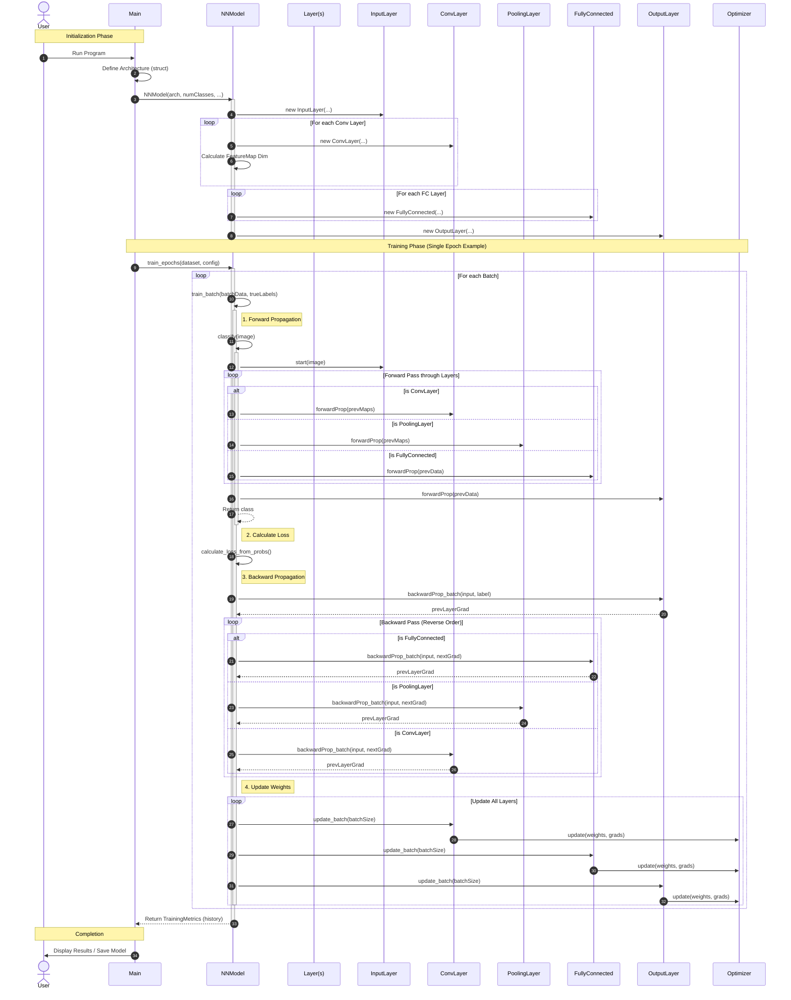

# Software Design Document: CGROOT++

**Project Name:** CGROOT++ (C++ Graph Root)  
**Version:** 1.0.0  
**Date:** December 23, 2025  

---

## 1. Introduction

### 1.1 Problem Statement
Deep learning frameworks like PyTorch and TensorFlow are powerful tools that abstract away the underlying mathematical mechanics, effectively making them "black boxes" for students and novice researchers. There is a distinct lack of lightweight, educational frameworks that expose the low-level implementation of automatic differentiation and tensor operations in C++ while remaining performant enough for practical experimentation.

### 1.2 Scope
* **What the software does:**
    * Provides a "from-scratch" C++ engine for tensor manipulation and automatic differentiation (Autograd).
    * Implements core neural network components: Linear layers, Activation functions (ReLU, Sigmoid), and Loss functions (MSE, Cross-Entropy).
    * Includes a Python-based GUI (PyQt6) for real-time visualization of training metrics and feature maps.
    * Allows users to build, train, and save Sequential models on CPU.
* **What the software does NOT do:**
    * It does not currently support GPU acceleration (CUDA).
    * It does not support distributed training across multiple machines.
    * It does not yet include complex architectural layers like Transformers or RNNs.

### 1.3 Target Audience
* **Students & Academics:** Those studying the internal mathematics of Deep Learning and Computational Graphs.
* **C++ Developers:** Engineers looking to integrate lightweight Machine Learning inference into C++ applications without heavy dependencies like LibTorch.

---

## 2. System Analysis

### 2.1 Functional Requirements
* **FR-01 Data Loading:** The system shall parse and load MNIST and CSV datasets into `Tensor` objects.
* **FR-02 Model Configuration:** The user shall be able to define a neural network architecture by stacking layers (e.g., Linear, ReLU) sequentially.
* **FR-03 Forward Propagation:** The system shall calculate the output of the network by passing input data through the computation graph.
* **FR-04 Automatic Differentiation:** The system must automatically calculate gradients for all learnable parameters using the chain rule (Backward Propagation).
* **FR-05 Optimization:** The system shall update model weights using selectable optimizers (SGD, Adam, Momentum).
* **FR-06 Visualization:** The GUI shall display a live graph of Loss vs. Epoch during the training process.
* **FR-07 Persistence:** The system shall allow the user to save trained model weights to a file and load them for inference.

### 2.2 Non-Functional Requirements
* **NFR-01 Performance:** The forward pass for a standard Multi-Layer Perceptron (MLP) on the MNIST dataset must execute in under 50ms on a standard CPU.
* **NFR-02 Portability:** The core C++ engine must be compilable on Windows (MSVC), Linux (GCC), and macOS (Clang) using CMake.
* **NFR-03 Reliability:** The mathematical gradient calculation must match numerical approximations within a tolerance of $1e^{-5}$.
* **NFR-04 Usability:** The C++ API syntax should mimic PyTorch (e.g., `model.forward()`, `loss.backward()`) to lower the learning curve.

---

## 3. System Design

### 3.1 Use Case Diagram
* **Actors:** User, File System.
* **Key Use Cases:**
    * **User:** Load Dataset, Configure Hyperparameters (Learning Rate, Batch Size), Start Training, Visualize Feature Maps, Save Model.
    * **File System:** Read MNIST Data, Write Model Weights.

### 3.2 Class Diagram
The system follows a strict Object-Oriented architecture to ensure modularity.
* **`Tensor`**: The core class managing the data buffer and shape. It contains a pointer to a `GradFn` object for autograd purposes.
* **`Module` (Abstract)**: Base class for all layers.
    * **`Linear` (Inherits Module)**: Contains weight and bias Tensors.
    * **`Sequential` (Inherits Module)**: A container that holds a vector of Modules (Composite Pattern).
* **`Optimizer` (Abstract)**: Base class for update algorithms.
    * **`SGD` (Inherits Optimizer)**: Implements Stochastic Gradient Descent logic.
* **`Graph`**: Manages the directed acyclic graph (DAG) of operations for backpropagation.

### 3.3 Sequence Diagram (Feature: Training Step)


---

## 4. Implementation Details

### 4.1 Tech Stack
* **Core Engine:** **C++17** (Chosen for high-performance memory management and template meta-programming capabilities).
* **Build System:** **CMake 3.10+** (Chosen for cross-platform compatibility).
* **GUI:** **Python 3.8 + PyQt6 + PyQtGraph** (Chosen for rapid UI development and high-speed plotting capabilities compared to native C++ GUI frameworks).
* **Interfacing:** Custom Subprocess pipes (To communicate between the C++ backend and Python frontend).

### 4.2 Design Patterns
1.  **Composite Pattern (`Sequential` Class):**
    * *Justification:* Used to treat individual layers (like `Linear`) and collections of layers (`Sequential`) uniformly. This allows users to nest models within models seamlessly.
2.  **Strategy Pattern (`Optimizer` Class):**
    * *Justification:* Allows the optimization algorithm (SGD, Adam, RMSProp) to be swapped interchangeably at runtime without changing the core training loop code.
3.  **Template Method Pattern (Layers):**
    * *Justification:* The `Module` base class defines the skeleton of the `forward` pass, while subclasses (`ReLU`, `Linear`) implement the specific mathematical logic.

### 4.3 Key Algorithms: Automatic Differentiation (Backward Pass)
The core of CGROOT++ is the Autograd engine. It uses a **Define-by-Run** dynamic graph.
* **Time Complexity:** $O(N)$ where $N$ is the number of operations in the graph.

**Pseudocode:**
```text
Function Backward(node):
    If node has no gradient: return
    
    Current_Gradient = node.gradient
    
    For each parent of node:
        Local_Gradient = ComputeDerivative(node, parent)
        Parent_Global_Gradient = Current_Gradient * Local_Gradient
        
        Accumulate parent.gradient += Parent_Global_Gradient
        
        If parent is not a leaf:
            Backward(parent) // Recursive call
