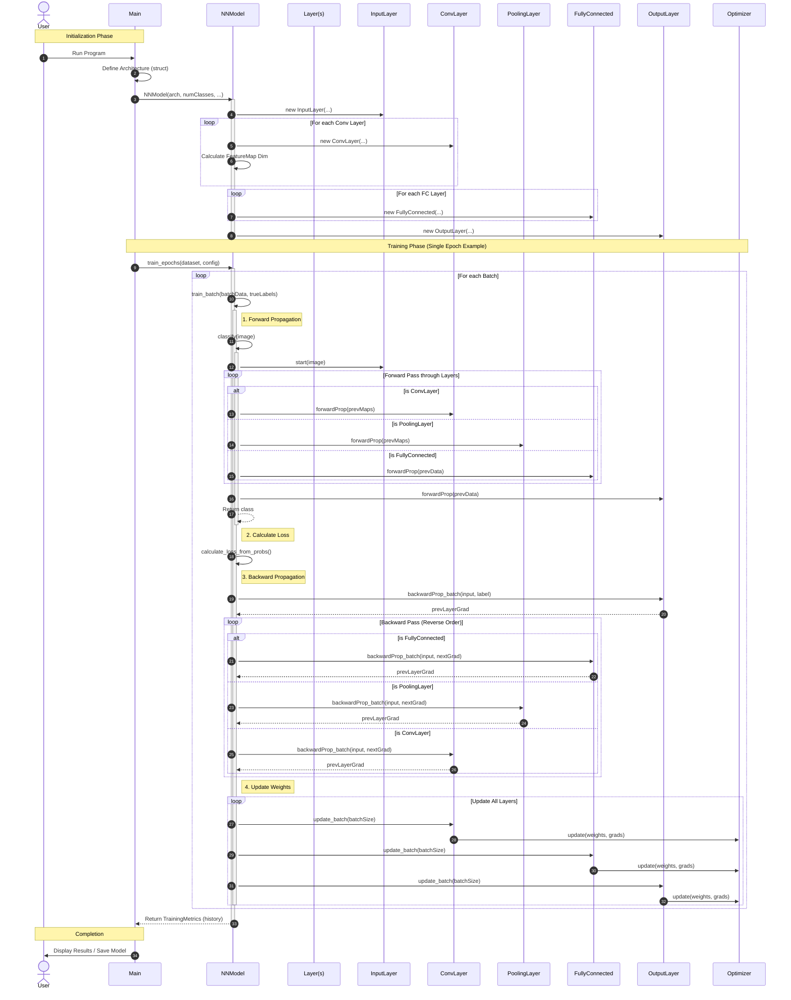

# Software Design Document: CGROOT++

**Project Name:** CGROOT++ (C++ Graph Root)  
**Version:** 1.0.0  
**Date:** December 23, 2025  

---

## 1. Introduction

### 1.1 Problem Statement
Deep learning frameworks like PyTorch and TensorFlow are powerful tools that abstract away the underlying mathematical mechanics, effectively making them "black boxes" for students and researchers. CGROOT++ addresses the lack of lightweight, educational frameworks that provide low-level implementations of automatic differentiation, convolutional operations, and optimization algorithms in C++ while remaining accessible via a user-friendly GUI.

### 1.2 Scope
* **What the software does:**
    * Implements core neural network layers: Convolutional (Conv2D), Pooling (Max/Average), Flatten, and Fully Connected layers.
    * Supports multiple activation functions (ReLU, Sigmoid, Tanh, Softmax) and advanced optimizers (Adam, RMSprop, Momentum).
    * Includes a feature-rich Python GUI (PyQt6) for interactive model configuration, real-time training visualization, feature map inspection, and image inference.
    * Enables model persistence (saving/loading architecture and weights) for reproducible experiments.
    * Utilizes OpenMP for multi-threaded CPU acceleration.
* **What the software does NOT do:**
    * It does not support GPU acceleration (CUDA/OpenCL).
    * It does not support distributed training or cloud-based deployment.

### 1.3 Target Audience
* **Students & Educators:** Those seeking to understand the internal mathematics and implementation of deep learning (CNNs, Backpropagation).


---

## 2. System Analysis

### 2.1 Functional Requirements
* **FR-01 Data Loader:** The system shall parse and load MNIST-format (IDX) binary datasets (MNIST, Fashion-MNIST, CIFAR-10) and automatically pair label files with image files.
* **FR-02 Neural Network Engine:** The system shall support complex architectures with Convolutional, Pooling (Max/Avg), Flatten, and Fully Connected layers, utilizing core activations (ReLU, Sigmoid, Tanh, Softmax) and loss functions (MSE, Cross-Entropy).
* **FR-03 Automatic Differentiation:** The system must implement a dynamic computational graph to automatically calculate gradients for all parameters via backpropagation.
* **FR-04 Optimization:** The system shall support advanced optimizers including SGD, SGD with Momentum, Adam, and RMSprop.
* **FR-05 Training & Inference:** The system shall support batch training with validation splits, real-time metric tracking, model persistence (save/load), and single-image inference.
* **FR-06 Graphical User Interface:** The Python-based GUI shall provide interactive configuration, real-time visualization of training metrics and image previews, feature map visualization, and comprehensive logging.

### 2.2 Non-Functional Requirements
* **NFR-01 Performance:** Heavy mathematical operations shall be implemented in optimized C++ utilizing OpenMP for parallelization to ensure high throughput.
* **NFR-02 Usability:** The GUI must remain responsive during training. 
* **NFR-03 Reliability:** Gradient calculations must be numerically verified, and the system must handle data types safely between C++ and Python.
* **NFR-04 Extensibility:** The modular architecture (using pybind11) shall allow for easy addition of new layers and optimizers without refactoring the core engine.
* **NFR-05 Portability:** The system must be cross-platform (Windows, Linux, macOS), buildable via CMake, and function entirely locally without external dependencies.
---

## 3. System Design

### 3.1 Sequence Diagram

### 3.2 Class Diagram

```mermaid
classDiagram
    direction TB

    %% --- Python GUI / Bindings ---
    class ModelController {
        + create_model(config)
        + start_training()
        + stop_training()
        + requestLoadDataset(images, labels)
        + requestTrain(config)
        + requestInference(image)
    }
    style ModelController fill:#e3f2fd,stroke:#1565c0,stroke-width:2px,stroke-dasharray: 5 5

    class Bindings {
        &lt;&lt;PyBind11&gt;&gt;
        + create_model(dict) NNModel*
        + classify_pixels(buffer) int
        + bind_model(module)
    }
    style Bindings fill:#eceff1,stroke:#455a64,stroke-width:2px

    %% --- Data Utilities ---
    class MNISTLoader {
        &lt;&lt;Static Utility&gt;&gt;
        + load_training_data(images_path, labels_path) MNISTDataset
        + load_test_data(images_path, labels_path) MNISTDataset
        + create_batches(dataset, batch_size) vector~vector~MNISTImage~~
    }
    style MNISTLoader fill:#e0f2f1,stroke:#00695c,stroke-width:2px

    class MNISTDataset {
        + vector~MNISTImage~ images
        + size_t num_images
        + size_t image_width
        + size_t image_height
    }
    style MNISTDataset fill:#e0f2f1,stroke:#00695c,stroke-width:2px

    %% --- Core Components ---
    class NNModel {
        - vector~Layer*~ Layers
        - image data
        - size_t imageHeight
        - size_t imageWidth
        - size_t imageDepth
        - vector~TrainingMetrics~ trainingHistory
        + NNModel(architecture, ...)
        + train(image, int) pair~double,int~
        + train_batch(vector~image~, vector~int~) pair~double,int~
        + train_epochs(dataset, config, ...) vector~TrainingMetrics~
        + classify(image) int
        + getLayerFeatureMaps(layerIndex)
        + getLayerType(layerIndex)
        + store(folderPath) bool
        + load(filePath) bool
        + getTrainingHistory()
    }
    style NNModel fill:#e1f5fe,stroke:#01579b,stroke-width:2px

    class Definitions {
        &lt;&lt;Enumeration&gt;&gt;
        OptimizerType
        LayerType
        activationFunction
        initFunctions
        poolingLayerType
        distributionType
    }
    style Definitions fill:#e1f5fe,stroke:#01579b,stroke-width:2px

    class architecture {
        + size_t numOfConvLayers
        + size_t numOfFCLayers
        + vector~convKernels~ kernelsPerconvLayers
        + vector~size_t~ neuronsPerFCLayer
        + vector~activationFunction~ convLayerActivationFunc
        + vector~activationFunction~ FCLayerActivationFunc
        + vector~initFunctions~ convInitFunctionsType
        + vector~initFunctions~ FCInitFunctionsType
        + distributionType distType
        + vector~size_t~ poolingLayersInterval
        + vector~poolingLayerType~ poolingtype
        + vector~poolKernel~ kernelsPerPoolingLayer
        + OptimizerConfig optConfig
    }
    style architecture fill:#e1f5fe,stroke:#01579b,stroke-width:2px
    
    class TrainingConfig {
        + size_t epochs
        + size_t batch_size
        + float validation_split
        + bool use_validation
        + bool shuffle
        + uint random_seed
    }
    style TrainingConfig fill:#e1f5fe,stroke:#01579b,stroke-width:2px

    class TrainingMetrics {
        + int epoch
        + double train_loss
        + double train_accuracy
        + double val_loss
        + double val_accuracy
    }
    style TrainingMetrics fill:#e1f5fe,stroke:#01579b,stroke-width:2px

    %% --- Layer Hierarchy ---
    class Layer {
        &lt;&lt;Abstract&gt;&gt;
        + getLayerType()* LayerType
    }
    style Layer fill:#fafafa,stroke:#333,stroke-width:2px,stroke-dasharray: 5 5

    class inputLayer {
        - imageType normalizedImage
        - LayerType type
        + inputLayer(height, width, depth)
        + start(image)
        + getOutput() imageType
    }
    style inputLayer fill:#f3e5f5,stroke:#4a148c,stroke-width:2px

    class convLayer {
        - vector~kernelType~ kernels
        - vector~kernelType~ d_kernels
        - vector~double~ bias
        - vector~double~ d_bias
        - vector~featureMapType~ featureMaps
        - convKernels kernel_info
        - vector~vector~vector~Optimizer*~~~ kernelOptimizers
        - Optimizer* biasOptimizer
        + convLayer(kernelConfig, ...)
        + initKernel(...)
        + forwardProp(inputFeatureMaps)
        + backwardProp(inputFeatureMaps, grads)
        + backwardProp_batch(inputFeatureMaps, grads)
        + update()
        + update_batch(n)
        + convolute(inputFeatureMaps)
    }
    style convLayer fill:#f3e5f5,stroke:#4a148c,stroke-width:2px

    class poolingLayer {
        - poolKernel kernel_info
        - poolingLayerType poolingType
        - vector~featureMapType~ featureMaps
        + poolingLayer(kernelConfig, ...)
        + forwardProp(inputFeatureMaps)
        + backwardProp(inputFeatureMaps, grads)
        + backwardProp_batch(inputFeatureMaps, grads)
    }
    style poolingLayer fill:#f3e5f5,stroke:#4a148c,stroke-width:2px

    class FullyConnected {
        - vector~double~ inputCache
        - vector~double~ preActivation
        - vector~weights~ neurons
        - vector~double~ bias
        - vector~double~ outputData
        - vector~Optimizer*~ neuronOptimizers
        - Optimizer* biasOptimizer
        + FullyConnected(numOfNeurons, ...)
        + forwardProp(inputData)
        + backwardProp(inputData, grads)
        + backwardProp_batch(inputData, grads)
        + update()
        + update_batch(n)
    }
    style FullyConnected fill:#f3e5f5,stroke:#4a148c,stroke-width:2px

    class FlattenLayer {
        - vector~double~ flattened_Arr
        + FlattenLayer(h, w, d)
        + forwardProp(featureMaps)
        + backwardProp(grads)
        + backwardProp_batch(grads)
        + flat(featureMaps)
        + applyOptimizer(opt)
    }
    style FlattenLayer fill:#f3e5f5,stroke:#4a148c,stroke-width:2px

    class outputLayer {
        - vector~weights~ neurons
        - vector~double~ bias
        - vector~double~ outputData
        - vector~Optimizer*~ neuronOptimizers
        - Optimizer* biasOptimizer
        + outputLayer(numOfClasses, ...)
        + forwardProp(inputData)
        + backwardProp(inputData, correctClass)
        + backwardProp_batch(inputData, correctClass)
        + update()
        + update_batch(n)
        + getClass() int
    }
    style outputLayer fill:#f3e5f5,stroke:#4a148c,stroke-width:2px

    Layer <|-- inputLayer
    Layer <|-- convLayer
    Layer <|-- poolingLayer
    Layer <|-- FullyConnected
    Layer <|-- FlattenLayer
    Layer <|-- outputLayer

    %% --- Optimizers ---
    class Optimizer {
        &lt;&lt;Abstract&gt;&gt;
        # double learning_rate
        # double weight_decay
        + update(weights, grads)*
    }
    style Optimizer fill:#fafafa,stroke:#333,stroke-width:2px,stroke-dasharray: 5 5

    class SGD {
        + update(weights, grads)
    }
    style SGD fill:#e8f5e9,stroke:#1b5e20,stroke-width:2px

    class SGD_Momentum {
        - double momentum
        - vector~double~ v
        + update(weights, grads)
    }
    style SGD_Momentum fill:#e8f5e9,stroke:#1b5e20,stroke-width:2px

    class Adam {
        - double beta1
        - double beta2
        - double epsilon
        - int t
        - vector~double~ m
        - vector~double~ v
        + update(weights, grads)
    }
    style Adam fill:#e8f5e9,stroke:#1b5e20,stroke-width:2px

    class RMSprop {
        - double beta
        - double epsilon
        - vector~double~ s
        + update(weights, grads)
    }
    style RMSprop fill:#e8f5e9,stroke:#1b5e20,stroke-width:2px

    Optimizer <|-- SGD
    Optimizer <|-- SGD_Momentum
    Optimizer <|-- Adam
    Optimizer <|-- RMSprop

    %% --- Loss Functions ---
    class MSE {
        + compute(pred, target)$
        + gradient(grad, pred, target)$
    }
    style MSE fill:#fff3e0,stroke:#e65100,stroke-width:2px
    
    class BinaryCrossEntropy {
        + compute(pred, target)$
        + gradient(grad, pred, target)$
    }
    style BinaryCrossEntropy fill:#fff3e0,stroke:#e65100,stroke-width:2px
    
    class CategoricalCrossEntropy {
        + compute(pred, target)$
        + gradient(grad, pred, target)$
    }
    style CategoricalCrossEntropy fill:#fff3e0,stroke:#e65100,stroke-width:2px
    

    %% --- Relationships ---
    ModelController ..> Bindings : invokes
    Bindings ..> NNModel : creates/wraps
    Bindings ..> MNISTLoader : uses
    
    MNISTLoader ..> MNISTDataset : produces
    NNModel ..> MNISTDataset : consumes
    
    NNModel "1" *-- "*" Layer : contains
    NNModel ..> architecture : uses
    NNModel ..> TrainingConfig : uses
    NNModel ..> TrainingMetrics : produces
    
    NNModel ..> Optimizer : uses
    FullyConnected ..> Optimizer : uses
    convLayer ..> Optimizer : uses
    outputLayer ..> Optimizer : uses
```



---

## 4. Implementation Details

### 4.1 Tech Stack
* **Core Engine:** **C++17** (Chosen for high-performance memory management and template meta-programming capabilities).
* **Build System:** **CMake 3.10+** (Chosen for cross-platform compatibility).
* **GUI:** **Python 3.8 + PyQt6 + PyQtGraph** (Chosen for rapid UI development and high-speed plotting capabilities compared to native C++ GUI frameworks).
* **Interfacing:** Custom Subprocess pipes (To communicate between the C++ backend and Python frontend).

### 4.2 Design Patterns
1.  **Composite Pattern (`Sequential` Class):**
    * *Justification:* Used to treat individual layers (like `Linear`) and collections of layers (`Sequential`) uniformly. This allows users to nest models within models seamlessly.
2.  **Strategy Pattern (`Optimizer` Class):**
    * *Justification:* Allows the optimization algorithm (SGD, Adam, RMSProp) to be swapped interchangeably at runtime without changing the core training loop code.
3.  **Template Method Pattern (Layers):**
    * *Justification:* The `Module` base class defines the skeleton of the `forward` pass, while subclasses (`ReLU`, `Linear`) implement the specific mathematical logic.

### 4.3 Key Algorithms: Automatic Differentiation (Backward Pass)
The core of CGROOT++ is the Autograd engine. It uses a **Define-by-Run** dynamic graph.
* **Time Complexity:** $O(N)$ where $N$ is the number of operations in the graph.

**Pseudocode:**
```text
Function Backward(node):
    If node has no gradient: return
    
    Current_Gradient = node.gradient
    
    For each parent of node:
        Local_Gradient = ComputeDerivative(node, parent)
        Parent_Global_Gradient = Current_Gradient * Local_Gradient
        
        Accumulate parent.gradient += Parent_Global_Gradient
        
        If parent is not a leaf:
            Backward(parent) // Recursive call
